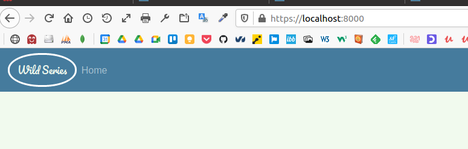
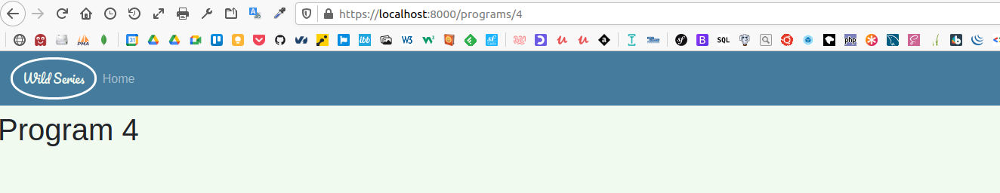
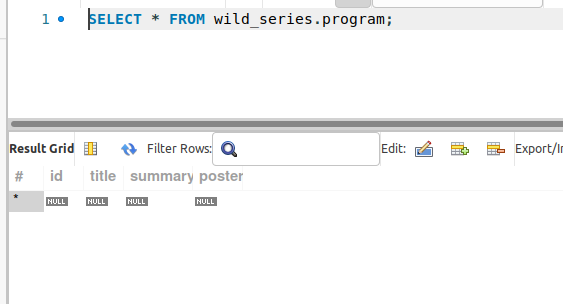
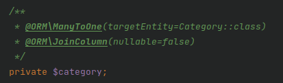
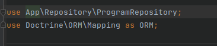
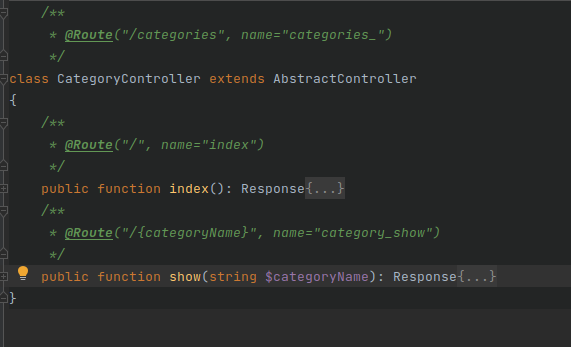
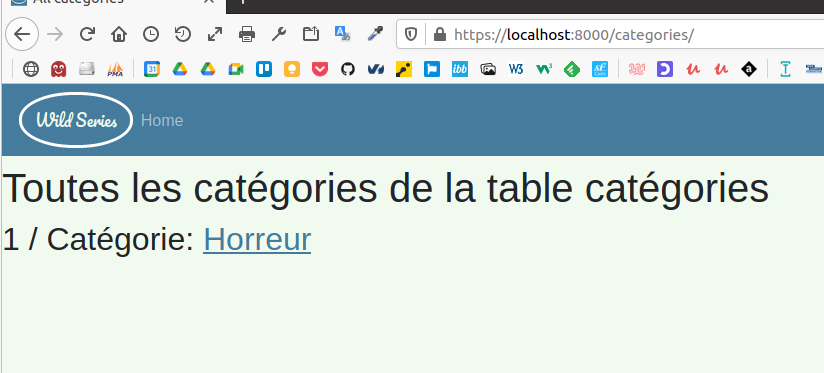
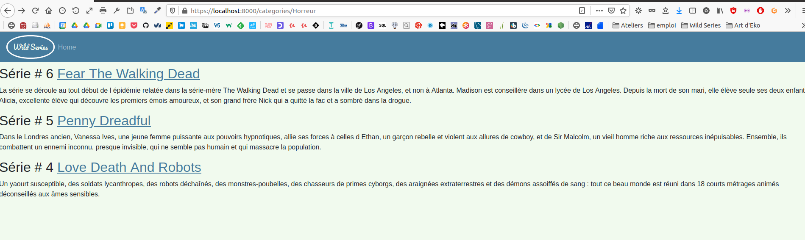
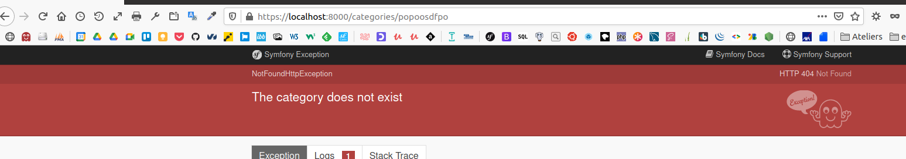

# wildSeries
##  Quête 4 Installation du module Webpack Encore

## Quête 5 routing avancé
Route /programs/4  
  

## Quête 5 routing avancé suite
Route /programs/quatre  

## Quête 6 première entité avec Doctrine
Category  

## Quête 6 première entité avec Doctrine suite
Program  

## Quête 7 Relation many to one
$category et annotation  
    
  
use  
  
  
Foreign Key  
  

## Quête 8 Récupération de données
categoty controller  
    
  
Route categories/  
  
  
Route categories/horreur  
  
  
Route categories/popoosdfpo  
  

## Quête 9 les fixtures  
[Lien vers la video](https://drive.google.com/file/d/1y28QER-o5KM8fPKcS2h5HzKIkxoPnUNs/view?usp=sharing)  

## Quête 10 relation bidirectionnelles  
[Lien vers la video](https://drive.google.com/file/d/1y28QER-o5KM8fPKcS2h5HzKIkxoPnUNs/view?usp=sharing)  

## Quête 11 param converteur  
[Lien vers la video](https://drive.google.com/file/d/1R2u1afYNbIrNEZsajB50eJj7D1G-Phco/view?usp=sharing)  

## Quête 12 form  
[Lien vers la video](https://drive.google.com/file/d/1wyiC8PM9d-yzGQAsCnJI9-ruH8USXxrN/view?usp=sharing)  

## Quête 13 CRUD  
[Lien vers la video](https://drive.google.com/file/d/1kKU0EGxe_6lx2cAn2yTpxHBbA-p5lBZQ/view?usp=sharing)  

## Quête 14 Validator  
[Lien vers la video](https://drive.google.com/file/d/1yZViEW3T5jLQINyiZj5SMfVI1zpUQFnx/view?usp=sharing)  

## Quête 15 Many to Many  
[Lien vers la video](https://drive.google.com/file/d/1npoWssFGYYO2kxVI6p1bzALpy8Xo5Ypb/view?usp=sharing)  

## Quête 16 Entity type 
[Lien vers la video](https://drive.google.com/file/d/1UNmqj-1a0wPZwxFmFqB_lZPsQre9RaFe/view?usp=sharing)  

## Quête 17 Fixtures avancées 
[Lien vers la video](https://drive.google.com/file/d/10UvBVXX5OYZRet96QDApC-qgJ2FoOu6U/view?usp=sharing)  

## Quête 18 Services  
[Lien vers la video](https://drive.google.com/file/d/1tJM3kf9ugiImhy6j9UBKnbmwbfWUh_5l/view?usp=sharing)  

## Quête 19 Mailer  
[Lien vers la video](https://drive.google.com/file/d/1sSlLh4Byh_1ppDYZciwvWRsjKOmO_NEe/view?usp=sharing)  

## Quête 20 Gestion des utilisateurs  
[Lien vers la video](https://drive.google.com/file/d/1PEW6bsBYmY8HrM44JLd69izglBDAyl4J/view?usp=sharing)  

## Quête 21 Sécurisation des routes  
[Lien vers la video](https://drive.google.com/file/d/1K8CTKiZkAcNuuFWjGAX0Mjzm1_UCU53b/view?usp=sharing)  

## Quête 22 Inscription d'un utilisateur  
[Lien vers la video](https://drive.google.com/file/d/1HI90wXJeM3dsLTry5GulBrs_lr7ayoR9/view?usp=sharing)  

## Quête 23 Requêtes pesonnalisées  
[Lien vers la video](https://drive.google.com/file/d/1bxKPl3bV2iXLt6G1UyGK0AXNhzobYmBU/view?usp=sharing)  

## Quête 24 Sessions et message flash  
[Lien vers la video](https://drive.google.com/file/d/1aepaGm9SsiFlgq9_lnZa62eH5gK97og6/view?usp=sharing)  

## Quête 25  AJAX
[Lien vers la video](https://drive.google.com/file/d/1uPorSc9hixH9Zb6oHMWGaCiD1-9-Wuov/view?usp=sharing)    

## Quête 26  I18N
[Lien vers la video](https://drive.google.com/file/d/1uPorSc9hixH9Zb6oHMWGaCiD1-9-Wuov/view?usp=sharing)    

## Quête 27  Embedding Controllers
[Lien vers la video](https://drive.google.com/file/d/1zuckKOofRsMtnaxir6sGFsUvs3YnOKJq/view?usp=sharing)    

## Quête 28 Upload  
[Lien vers la video](https://drive.google.com/file/d/1VyG15Y6L65vXMdu1-xroM6uwp-f61Prp/view?usp=sharing)  

